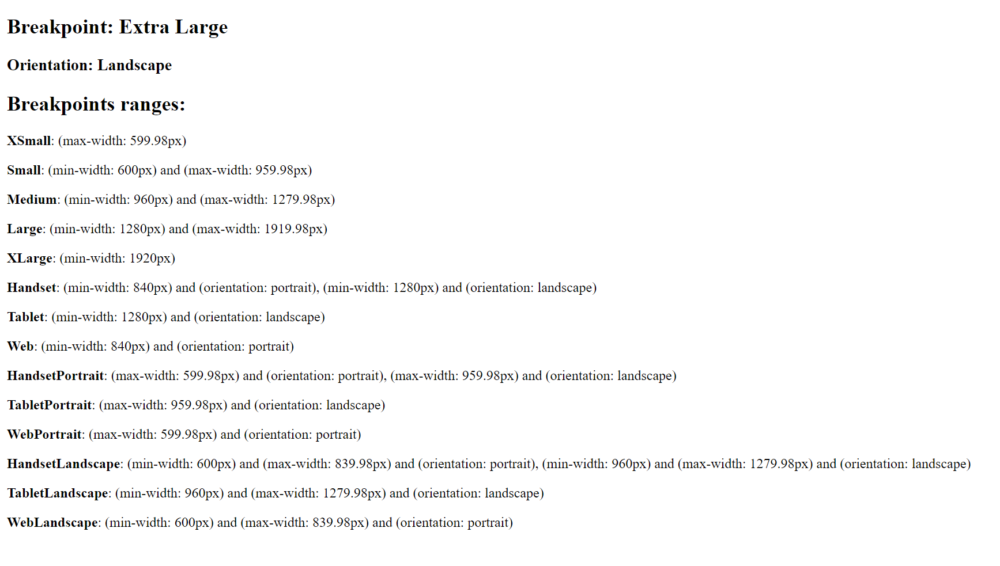

# Cdk BreakpointObserver Example Application

The application demonstrates the use of `BreakpointObserver` together with `MediaMatcher` from the `@angular/cdk/layout` package, which provides utilities to build responsive UIs that react to screen-size changes.

By resize browser window, we can observe current screen size changes.
The screen also displays the values (in pixels) for all the breakpoints predefined in the package.

Application dependencies:
*  Angular 13.1.0
*  Angular CDK 13.1.0
*  TypeScript 4.5.2

- - -

###### Getting Started

Clone this repository and execute the following commands in a terminal:

* `npm install`
* `npm start` for dev server Navigate to `http://localhost:4200/`. The app will automatically reload if you change any of the source files.

#### Notes

This project was generated with [Angular CLI](https://github.com/angular/angular-cli) version 13.1.2.
